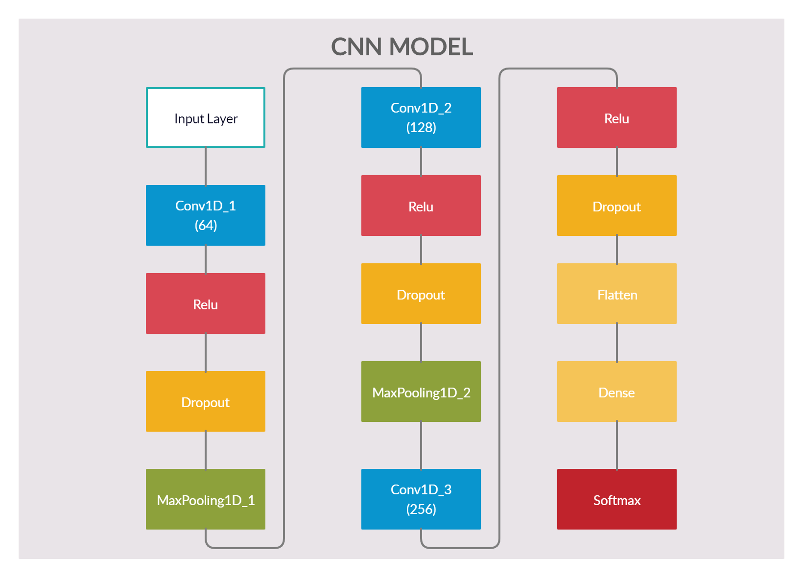
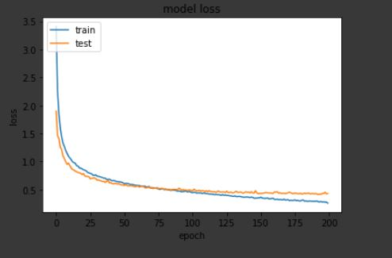
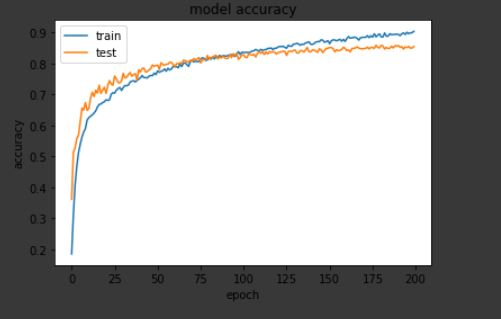
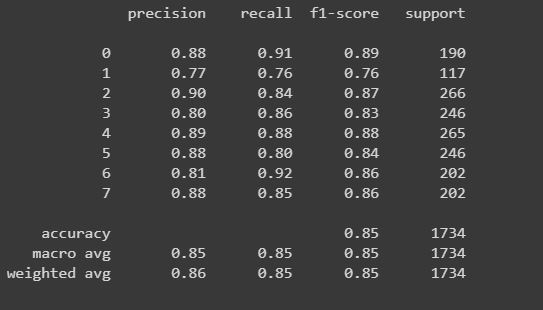

# Speech-Emotion-Recognition-using-ML-and-DL
Emotions are important part of understanding human interactions. Research is going into finding methods that can at the very least mimic human ability to recognise emotions displayed in the form of facial expressions, changes in tone while speaking, etc. Speech Emotion Recognition (SER) is one of such fields. Using deep learning and machine learning algorithms with the help of Ravdess and TESS dataset we aim to design an automatic emotion recognition system.

**Feature set information**

For this task, the dataset is built using 5252 samples from:

- the [Ryerson Audio-Visual Database of Emotional Speech and Song (RAVDESS) dataset](https://zenodo.org/record/1188976#.XsAXemgzaUk) 
- the [Toronto emotional speech set (TESS) dataset](https://tspace.library.utoronto.ca/handle/1807/24487) 

The samples include: 

- 1440 speech files and 1012 Song files from **RAVDESS**. This dataset includes recordings of 24 professional actors (12 female, 12 male), vocalizing two lexically-matched statements in a neutral North American accent. Speech includes calm, happy, sad, angry, fearful, surprise, and disgust expressions, and song contains calm, happy, sad, angry, and fearful emotions. Each file was rated 10 times on emotional validity, intensity, and genuineness. Ratings were provided by 247 individuals who were characteristic of untrained adult research participants from North America. A further set of 72 participants provided test-retest data. High levels of emotional validity, interrater reliability, and test-retest intrarater reliability were reported. Validation data is open-access, and can be downloaded along with our paper from [PLoS ONE](https://journals.plos.org/plosone/article?id=10.1371/journal.pone.0196391).

- 2800 files from **TESS**. A set of 200 target words were spoken in the carrier phrase "Say the word _____' by two actresses (aged 26 and 64 years) and recordings were made of the set portraying each of seven emotions (anger, disgust, fear, happiness, pleasant surprise, sadness, and neutral). There are 2800 stimuli in total. Two actresses were recruited from the Toronto area. Both actresses speak English as their first language, are university educated, and have musical training. Audiometric testing indicated that both actresses have thresholds within the normal range.

**Metrics**

*Model summary*

 

*Loss and accuracy plots*

 



*Classification report*


*Confusion matrix*



**How to use the code inside this repository**

1)  ```git clone https://github.com/abhay8463/Speech-Emotion-Recognition-using-ML-and-DL.git ``` OR, as an alternative, all the optional steps below.

2)  Download Audio_Song_Actors_01-24.zip and Audio_Speech_Actors_01-24.zip, unzip and merge the content of the folders (e.g. Actor_01 should include both Speech and Song) and then add it to the ```features``` folder.

2)  Create two empty folders, ```Actor_25``` and ```Actor_26```, into the ```features``` folder.

3)  Download the TESS dataset and unzip it into the ```TESS_Toronto_emotional_speech_set_data``` folder.
The format you need to have to make the following steps work is:

    ```
    TESS_Toronto_emotional_speech_set_data
    --OAF_angry
    --OAF_disgust
    --Other Folders..
    ```
4)  Run ```tess_pipeline.py```: this will copy the files in the ```Actor_25``` and ```Actor_26``` folders with a usable naming convention. For details, read the docstrings of ```tess_pipeline.py```.

6) *ONLY IF YOU WANT TO CREATE NEW FEATURES*: run ```create_features.py```. Please note this is NOT necessary as in the ```features``` folder there are already the joblib files created with ```create_features.py```.

7) *ONLY IF YOU WANT TO CREATE A NEW MODEL*:  run the python notebook [SER(Deep_Learning).ipynb](Deep Learning/SER(Deep_Learning).ipynb). Please note this is NOT necessary as in the ```DeepLearning``` folder there is already a [pre_trained model](Deep Learning/SER_model.h5) to use.

**How to test the model created in this work**

Let's be clear. When we talk about emotions understanding, we are talking about a very difficult task. 

I have pasted two files in the ```examples``` folder:

a) 03-01-01-01-01-02-05.wav is an example of WRONG prediction: it is a NEUTRAL file, the model predicts CALM. Try to listen to the audio yourself. Which is the emotion for you? For me CALM seems a fair prediction. That speaker is classified as neutral, but he is not angry at all. You see my point?

b) 10-16-07-29-82-30-63.wav is a DISGUST file. The model is getting it.

Feel free to try with other files or record your voice. I still have to try this last one but I am very curious about the result.

*Important note*: the classes are encoded from 0 to 7 in the code. In the dataset, from 01 to 08. Be aware when you try. If the model predicts 0 and you are using a NEUTRAL file (01), this is correct and the expected behavior. Keras wants the predictions to start from 0 and not from 1, so the code is adjusted to cope with this requirement.

Team Members:
Abhay Gupta,
Aditya Karmokar,
Khadija Mohamad Haneefa, 
Chennaboina Hemantha Lakshmi
